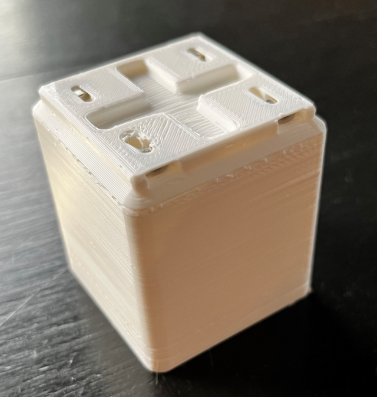

# Gridfinity

More derived designs based on the [Gridfinity](https://thangs.com/search/gridfinity) system by [Zach Freedman](https://www.youtube.com/c/ZackFreedman/about) of [Voidstar Lab](https://www.voidstarlab.com/).

## Useful Links

* Curated [Gridfinity catalog](https://github.com/jeffbarr/gridfinity-catalog) by Jeff Barr.

# Custom Designs

I *love* the magnets to provide a nice, secure mount for the Gridfinity bins to their bases, but  I really dislike using glue.  The key differentiator of these designs is that  I've tried to use snap fits or heat stakes where possible to avoid using glue.  

Here's an example of my 3u-1x1 bin with snap fit slots for the magnets:

## Tools

* ME-CAD: SolidWorks - I'm an engineer and have access to SolidWorks due to my job.  Thus all CAD is SolidWorks.  I try to provide STEP files for designs for import into other CAD packages.
* Slicer - [Prusa Slicer](https://www.prusa3d.com/page/prusaslicer_424/).
* 3D Printer - My main 3D printer is a [Creality Ender 3](https://www.creality.com/products/ender-3-3d-printer).

## Materials and Components

Here's a short list of materials used for these designs:

* Designs printed with [Hatchbox White PLA](https://www.amazon.com/gp/product/B00J0GMMP6/ref=ppx_yo_dt_b_asin_title_o06_s01).
* Magnets are [6mm diameter by 2mm thick "refrigerator" magnets](https://www.amazon.com/gp/product/B07KJ9H31P/ref=ppx_yo_dt_b_asin_title_o08_s02).  These are nickel coated Neodymium magnets.
* For bases that will sit on the desk, [silica gel bumper feet](https://www.amazon.com/gp/product/B081J3Q641/ref=ppx_yo_dt_b_asin_title_o05_s00) are used.  They really help hold the base in place.  Use a 5 mm diameter by 6.5 mm deep hole for inserting the feet.
* For windows, [microscope slides](https://www.amazon.com/gp/product/B0747R2M26/ref=ppx_yo_dt_b_asin_title_o00_s00) are used.  When smaller windows are needed, these are cut with [pencil style glass cutting tool](https://www.amazon.com/gp/product/B0B3D2G499/ref=ppx_yo_dt_b_asin_title_o04_s00).

    *Note*: I had tried using the glass slide covers that some with the microscope slides.  However, they're only 0.2 mm thick, and thus very fragile. This is a safety issues, so they are not used. 

## Bins

* [3u-1x1](bins/3u-1x1) - Standard bin with magnet snap fit slots.  Note that there are also slots under the label surface to help keep stacked bins in place.  Also posted to [Thingiverse](https://www.thingiverse.com/thing:5541233).
* [3u-1x1](bins/3u-1x1-split) - The 3u-1x1 bin with a central divider.
* [Caliper Holder](bins/caliper-holder-2x1) - 2x1 caliper holder for my [digital calipers](https://www.amazon.com/REXBETI-Micrometer-Measuring-Millimeter-Protection/dp/B07C94MHJ4/ref=sr_1_3), inspired by [Zach Freedman's design](https://thangs.com/designer/ZackFreedman/3d-model/Gridfinity%20Caliper%20Holder-62216).  This holder uses a magnet to retain the spare battery and screwdriver.
* [Superglue Tube Holder](bins/superglue-tube-holder) - Holds 3x 2g super glue tubes. 
* [Base Seed](bins/bin-base-seed-2x1.SLDPRT) - This is a SolidWorks part for a simple 2x1 base with magnet snap fit features from which to design new bins.

## Bases

*Note*: Desktop bases use the silica gel feet to keep them from sliding.

* [Desktop 3x2](bases/desktop-base-3x2) - 3x2 base.
* [Desktop 6x1](bases/desktop-base-6x1) - 6x1 long base.
* [Wall Mount 2x1](bases/wall-bracket-2x1) - Wall mount base using screws for mounting.
* [Base Seed](bases/baseplate-seed-1x1.SLDPRT) - This is a SolidWorks part fpr 1x1 base with magnet snap fit features from which to design new bases.
