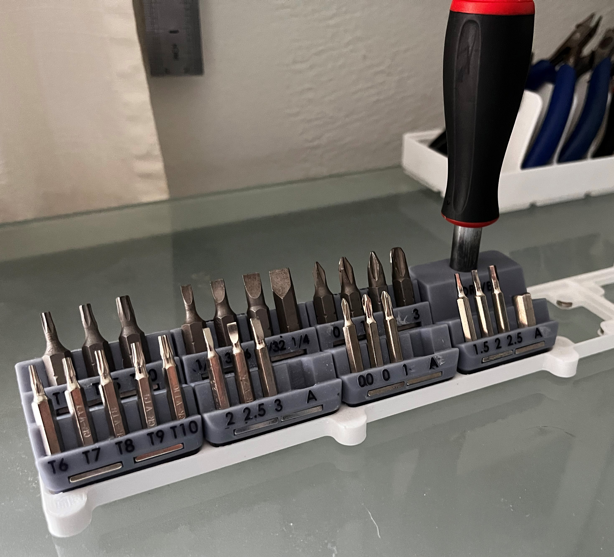

# Hex Bit Holders

There are [several options available](https://thangs.com/search/gridfinity%20hex%20bit%20holder?scope=all) for hex bit holders for small drivers.  
I took a slightly different approach and created a bin per driver type.  My thinking is that I typically need one driver type (hex, phillips, etc.) at time, so 
just grab the set I'm using.  
